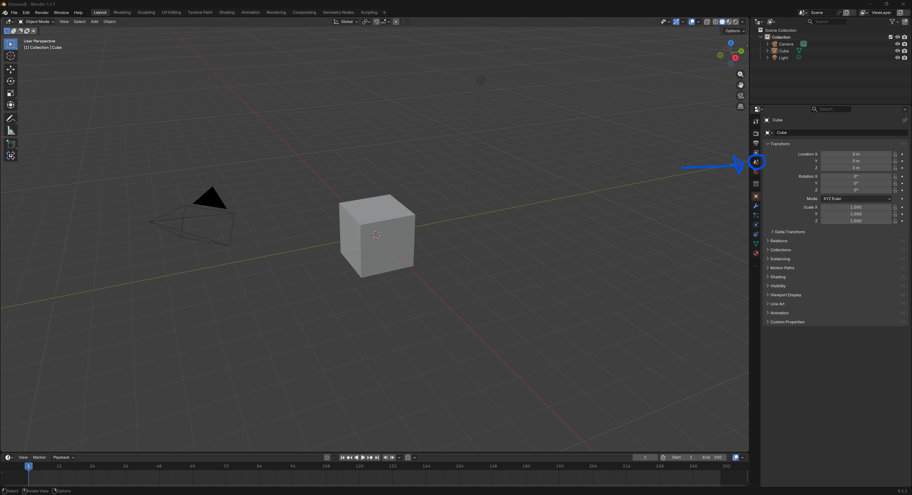
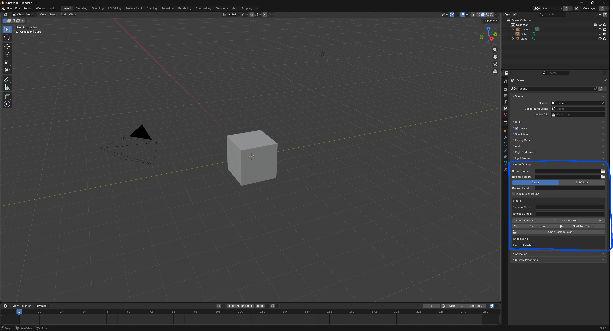
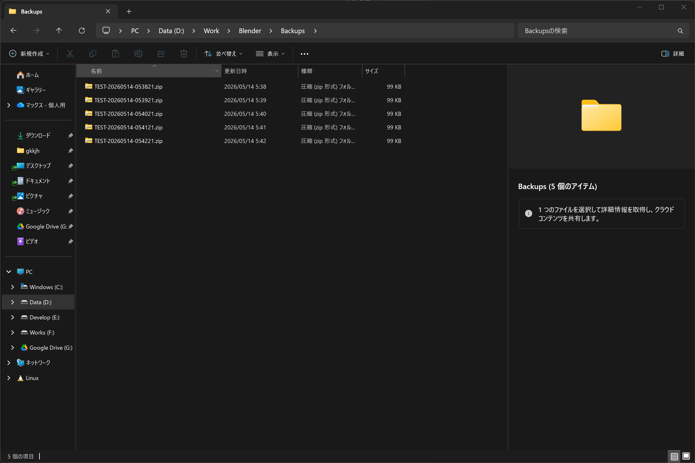

# User Guide

Blender Auto Backup は、指定した作業フォルダを ZIP として保存する Blender 4.2+ 向けアドオンです。ここでは、利用者が Blender 上で設定してバックアップを作成する流れを説明します。

## 画面の開き方

Blender で右側の Properties エリアを開き、Scene プロパティタブを選びます。

Scene プロパティ内に `Auto Backup` パネルが表示されます。

## 基本の使い方

1. `Source Folder` にバックアップしたい作業フォルダを指定します。
2. `Backup Folder` に ZIP の保存先を指定します。
3. 保存先の構成を `Direct` または `Subfolder` から選びます。
4. 必要に応じて `Backup Label`、`Run in Background`、`Include Globs`、`Exclude Globs` を設定します。
5. `Interval Minutes` と `Max Backups` を確認します。
6. ZIP を作る前に対象数を確認したい場合は `Preview Backup` を押します。
7. すぐにバックアップしたい場合は `Backup Now` を押します。
8. 定期バックアップを使う場合は `Start Auto Backup` を押します。
9. 作成先を確認したい場合は `Open Backup Folder` を押します。

`Last` が `Preview:` で始まる場合は、ZIP を作らずに対象ファイル数、合計バイト数、保存予定先を確認した状態です。`Last` が `OK:` で始まる表示になればバックアップは成功です。`Enabled` は定期バックアップが有効かどうかを示します。

## 保存先の選び方

`Backup Folder` を空にした場合、アドオン設定の `Default Backup Folder` が使われます。そこも空の場合は、`Source Folder\.blender-auto-backup` に ZIP が作成されます。

`Direct` は、指定した保存先フォルダの直下に ZIP を作成します。既存の動作と互換性があります。

`Subfolder` は、指定した保存先フォルダの下に対象フォルダ名または `Backup Label` のサブフォルダを作り、その中に ZIP を作成します。複数の作業フォルダを同じ保存先で管理したい場合に使います。

## 生成されるバックアップ

バックアップ ZIP は `BackupLabel-yyyymmdd-hhmmss.zip` の形式で作成されます。`Max Backups` を超えた古い ZIP は自動で削除されます。

保存先フォルダが作業フォルダの中にある場合でも、保存先フォルダ自体はバックアップ対象から除外されます。作成中の ZIP は `.partial` として一時作成され、完了後に正式な ZIP に置き換えられます。

## Preview

`Preview Backup` は、現在の設定で ZIP に入るファイル数、合計バイト数、保存予定先を `Last` に表示します。ZIP ファイル、保存先フォルダ、`.partial` ファイルは作成しません。

保存先が作業フォルダ内にある場合や include / exclude glob を指定している場合も、`Backup Now` と同じ判定で対象を数えます。フィルタがすべてのファイルを除外した場合は、バックアップ作成前にエラーを確認できます。

## フィルタ

`Include Globs` を指定すると、条件に合うファイルだけをバックアップします。`Exclude Globs` を指定すると、条件に合うファイルやフォルダを除外します。

例:

- `Include Globs`: `*.blend`
- `Exclude Globs`: `cache/**`

この例では `.blend` ファイルだけを候補にし、そのうち `cache` フォルダ配下は除外します。

## 困ったとき

- `Source Folder does not exist`: `Source Folder` に存在するフォルダを指定してください。
- ZIP が増え続ける: `Max Backups` の値を確認してください。
- バックアップ対象数を先に確認したい: `Preview Backup` を押してください。
- 生成先が分からない: `Open Backup Folder` を押してください。
- 定期バックアップが動かない: `Start Auto Backup` を押したあと、`Enabled: Yes` になっているか確認してください。
